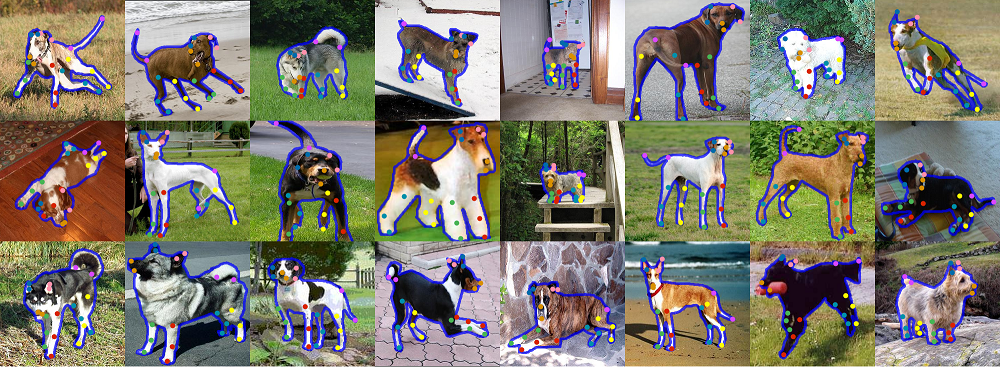

# StanfordExtra
12k labelled instances of dogs in-the-wild with 2D keypoint and segmentations. 

Dataset released with our ECCV 2020 paper: *Who Left the Dogs Out? 3D Animal Reconstruction with Expectation Maximization in the Loop*.

- [Project page](https://sites.google.com/view/wldo/home)
- [Paper](https://arxiv.org/abs/2007.11110)



## Usage
To understand how the dataset can be used, please read `demo.ipynb`.

## Installation
- All annotations, segmentations and metadata are sourced in a single .json file for ease of download. However, you will also need to download the [Stanford Dogs Dataset](http://vision.stanford.edu/aditya86/ImageNetDogs/) dataset to access the raw images. 

- For segmentation decoding, install `pycocotools`

`python -m pip install "git+https://github.com/philferriere/cocoapi.git#subdirectory=PythonAPI"`

- The `demo.ipynb` code is trivial to adapt to work with the full StanfordExtra dataset, by editing the line

```
img_dir = "sample_imgs" # Edit this to the location of the extracted tar file (e.g. /.../Images).
```

## Download & Versioning
The latest version of StanfordExtra is available for download within this repo. To view all released versions, view the [archive](https://drive.google.com/drive/folders/1MvN4hX2cdy0pMv0iUnL_UkobSYxZ0gzg?usp=sharing).

- Version 1.0 [23/08/20] - Initial release for ECCV 2020, 12k instances
- Version 0.1 [13/08/20] - Beta release, 11k instances

## Comments
You may also find the other datasets useful for your animal work:
- [Animal Pose Dataset](https://sites.google.com/view/animal-pose/)
- [RGBD-Dog Dataset](https://github.com/CAMERA-Bath/RGBD-Dog)
- [BADJA](https://github.com/benjiebob/BADJA)

We are also delighted to hear about your animal related activities! Please do visit [Benjamin Biggs](http://www.biggs.ai) to get in touch.

## Acknowledgements

If you make sure use of this annotation dataset, please cite the following paper:

```
@inproceedings{biggs2020wldo,
  title={{W}ho left the dogs out: {3D} animal reconstruction with expectation maximization in the loop},
  author={Biggs, Benjamin and Boyne, Oliver and Charles, James and Fitzgibbon, Andrew and Cipolla, Roberto},
  booktitle={ECCV},
  year={2020}
}
```

and the [Stanford Dog Dataset](http://vision.stanford.edu/aditya86/ImageNetDogs/) from which the images are derived:

```
@inproceedings{KhoslaYaoJayadevaprakashFeiFei_FGVC2011,
  author = "Aditya Khosla and Nityananda Jayadevaprakash and Bangpeng Yao and Li Fei-Fei",
  title = "Novel Dataset for Fine-Grained Image Categorization",
  booktitle = "First Workshop on Fine-Grained Visual Categorization, IEEE Conference on Computer Vision and Pattern Recognition",
  year = "2011",
  month = "June",
  address = "Colorado Springs, CO",
}
```

## Licensing

Non-commercial use only. Please contact us if you wish to use this dataset for commercial purposes.
Data is provided `As-is', we take no liability for any errors. 


